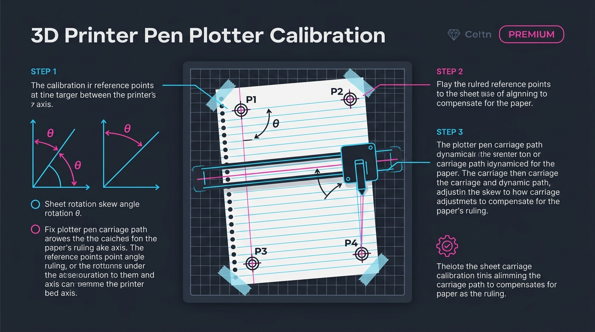
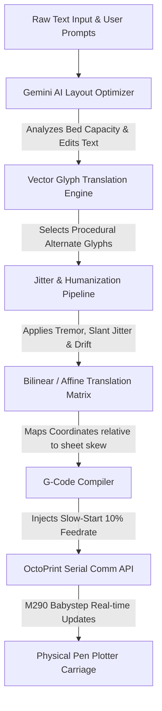

# 🖋️ OctoPrint-PlotterHandwriting

[](https://octoprint.org)
[](https://opensource.org/licenses/MIT)
[](https://deepmind.google/technologies/gemini)

An advanced, high-precision OctoPrint plugin and standalone web workbench to generate organic, human-looking handwriting G-code for 3D printers, pen plotters, and drawing machines. 

Equipped with a **3/4-Point Rigid Transformation calibration engine**, a **centerline tracing font skeletonizer**, a **buttery smooth canvas editor**, and a **Gemini AI Layout Optimizer**, this utility turns standard G-code plotters into expert human scribes.

---

## 🗺️ System Architecture & Data Flow

Below is the visual infographic outlining the complete compiler data pipeline and the 3D printer calibration alignment mechanism:





---

## 🌟 Key Features

### 1. 🪄 Gemini AI Layout Optimizer
* **Dynamic Content Fitting**: Automatically reads the layout spacing, checks the available physical bed capacity, and uses the Google Gemini API to rewrite, summarize, or expand your text to fit the lines.
* **Multi-Parameter Tuning**: Dynamically adjusts **Letter Height**, **Character Spacing**, and **Word Spacing** settings in tandem with editing text content to guarantee a pixel-perfect page layout.

### 2. 🎯 Interactive 3/4-Point Calibration
* **Skew & Rotation Auto-Correction**: Align paper at any angle! Simply jog your pen to the top-left (P1), top-right (P2), bottom-left (P3), and bottom-right (P4) corners of your paper margin. 
* **Real-time Error Validation**: Calculates the geometric difference between actual locked points and projected targets (parallelogram projection), displaying validation error rates in real time.
* **Canvas Tweaks**: Easily click and drag reference points on the canvas to visually fine-tune calibration coordinates.

### 3. 🌀 Humanization Jitter Engine
* **Procedural Alternates**: Randomly alternates glyph variants to ensure double letters (like 'oo' or 'll') look distinct.
* **Fluid Handwriting Jitters**: Simulates organic human hand tremor, letter slant jitter, baseline waviness/drift, and custom drag hooks when lifting/lowering the pen.

### 4. 🩻 Centerline Font Skeletonizer
* **Skeleton Mode**: Automatically collapses double-stroke closed-loop vector paths from standard TTF/OTF fonts into a single, clean centerline stroke, eliminating "bubble letter" hollow outlines.

### 5. 🐢 G-code Slow Start & Live Babystepping
* **Anti-Jitter Feedrate Control**: Tag and execute the first three words of a print job at **10% of standard feedrate** to prevent initial slippage.
* **Real-Time USB Jogging**: Adjust Y-axis offset (`M290 Y0.10`) and Z-offset height (`M290 Z0.02`) on the fly using our real-time micro-stepping adjustment panel.

---

## 📦 Installation & Setup

### Manual Installation
Clone this repository and install the Python package directly into your OctoPrint virtual environment:

```bash
cd OctoPrint-PlotterHandwriting
pip install .
```

### Standalone Web Workbench (Recommended)
You can run the full interactive workspace, layout designer, G-code generator, and calibration wizard directly inside your browser as a standalone tool:

1. Locate the [test_ui.html](test_ui.html) file in this directory.
2. Open it directly in Google Chrome, Safari, or Firefox:
   ```bash
   open test_ui.html
   ```
3. Enter your **OctoPrint API URL** and **API Key** in the connection panel to jog, calibrate, and print directly from the browser!

---

## 🧭 Step-by-Step Calibration & Printing Guide

Follow these steps for alignment on standard notebook ruled paper:

### Step 1: Secure and Align
Tape your ruled notebook page to the printbed. It doesn't have to be perfectly straight; our calibration engine handles skew up to 30°.

### Step 2: Establish Bed Points (Shift + Click)
Ensure **Live Calibration** is checked in Step 7 (which locks the manual calibration wizard to prevent coordinate conflicts).
1. **Point 1 (Top-Left)**: Hover over the canvas to see the red crosshair guides. Shift-click the intersection of your top red margin line and left vertical line to lock P1.
2. **Point 2 (Top-Right)**: The top margin guide line will track your cursor. Shift-click the top margin line on the right side of the page to lock P2.
3. **Point 3 (Bottom-Left)**: The 20 notebook ruled grid lines and left vertical margin will preview dynamically. Shift-click the intersection of the 20th horizontal line and left vertical margin to lock P3.
4. **Point 4 (Bottom-Right)**: The projected target circle for P4 appears in pink. Shift-click the 20th horizontal line on the right side to lock P4.
5. Inspect the **Calibration Accuracy** badge in the top-right. An error $< 1.5\text{ mm}$ is ideal.

### Step 3: AI-Optimize Layout
In Step 1, type your instruction (e.g. *"Fit text to lines"*), select a Gemini model (like **Gemini 2.5 Flash**), and click **Edit Text with AI**. The system automatically scales character heights and optimizes the spacing to fill the sheet perfectly.

### Step 4: Dry Run Verification
Click **Dry Run Verification (Servo Check)**. This generates G-code that travels the boundary margins with the pen lifted to visually verify alignment on the paper before drawing.

### Step 5: Upload & Real-time Tune
Click **Upload & Print**. During the initial slow-start phase, use the real-time tuning panel to micro-adjust offsets if the pen does not land perfectly on the paper lines:
* Use `▲` / `▼` to jog the Y-axis shift.
* Use `Pen Up` / `Pen Down` to jog Z-height.

---

## 🛠️ Configuration & Sliders

| Parameter | Recommended Value | Description |
| :--- | :--- | :--- |
| **Letter Height** | `3.5 - 5.5 mm` | Vertical scale of characters. |
| **Letter Vertical Offset** | `1.2 mm` | Adjusts how high above/below the notebook lines letters sit. Use `▲`/`▼` for 0.1mm micro-steps. |
| **Baseline Drift** | `0.05 - 0.15 mm` | Simulates slow vertical wave-like drift of lines. |
| **Wobble Strength** | `0.05 - 0.10 mm` | Simulates micro-tremors in hand grip. |
| **Slant Jitter** | `1.0° - 3.0°` | Adds minor slanting variation to individual characters. |

---

## 🛡️ License

Distributed under the MIT License. See [LICENSE](LICENSE) for more information.
